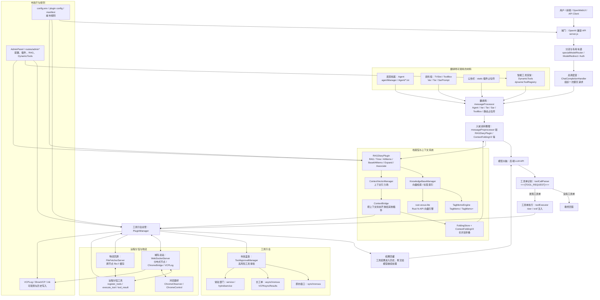

# VCP 概念学习手册 V1.1（人类版）

生成日期：2026-05-17  
定位：给人类读的快速理解手册  
来源：基于 `14-VCP系统深度导读-20260516.md`、VCPToolBox 源码与现有 `docs/` 文档重组  

## 0. 这份文档解决什么问题

如果把 14 号文档当作“研究母本”，这份 V1.1 就是“学习路线图”。

它不追求把每个源码细节都摊开，而是帮助你快速形成三个能力：

1. 知道 VCP 到底是什么。
2. 知道哪些能力适合怎么用。
3. 知道自己要造工具时，该放在哪一层。

一句话：

> VCP 不是一个简单聊天壳，而是一套把模型、提示词、记忆、工具、上下文、后台管理和分布式执行组织起来的 AI 中间层。

## 1. 学习新系统的五步框架

学习 VCP 不建议从某个插件硬啃。更适合按人类学习新事物的顺序来：

| 阶段 | 你要问的问题 | VCP 对应内容 |
|---|---|---|
| 建地图 | 这东西整体长什么样？ | API 入口、插件系统、RAG、分布式、管理面板 |
| 找主线 | 一次请求怎么流动？ | `server.js`、`chatCompletionHandler`、`messageProcessor`、`PluginManager` |
| 学工具 | 日常怎么使用？ | Agent、变量、DynamicTools、RAG 修饰符、工具调用协议 |
| 做组合 | 怎么把能力串起来？ | TagMemo + ContextBridge + DynamicTools + River/vref |
| 会创造 | 怎么造自己的能力？ | 插件 manifest、同步/异步/service/分布式工具 |

这一版文档会始终使用一个统一类比：

> 把 VCP 想成一座 AI 城市。模型是城市里的大脑，VCP 是道路、档案馆、工具铺、物流站、分馆网络和市政厅。

## 2. VCP 这座 AI 城市的总图

如果你想用更大的画布交互浏览，可以先打开 [17-VCP动态城市地图-20260517.html](17-VCP动态城市地图-20260517.html)。它把本节的关系图做成了可点击的动态版本。

先看一张更细的关系图。它不是严格的调用时序图，而是帮助人建立“这些模块彼此怎么协作”的城市地图。



如果 Mermaid 图不能渲染，可以看下面这个文字版：

```text
用户 / 前端 / OpenWebUI / API Client
        |
        v
城市城门：OpenAI 兼容 API + 鉴权 + 模型分流
server.js / routes/specialModelRouter.js / ModelRedirect
        |
        v
翻译局：变量、Agent、ToolBox、动态占位符
modules/messageProcessor.js
        |
        +-- 居民档案：Agent / agentManager
        +-- 资料柜：TVStxt / Var / Tar / SarPrompt
        +-- 公告栏：static 插件占位符
        +-- 智能货架：DynamicTools
        |
        v
档案馆：RAG、TagMemo、AIMemo、Time、附件召回、上下文状态
Plugin/RAGDiaryPlugin/ + KnowledgeBaseManager.js + TagMemoEngine.js
        |
        +-- ContextBridge：把上下文状态给其他插件
        +-- FoldingStore / ContextFoldingV2：长对话折叠
        +-- rust-vexus-lite：向量引擎
        |
        v
工具行会：本地插件、异步插件、service 插件、远程插件
Plugin.js + Plugin/*/plugin-manifest.json
        |
        v
模型大脑：后端 LLM API
        |
        v
工具单回路：VCP 工具协议 -> 执行 -> 结果回灌
modules/vcpLoop/*
        |
        v
市政系统：AdminPanel、审批、日志、分布式 WebSocket
routes/admin* + WebSocketServer.js
```

这张图要抓住四条线：

1. **主街道**：用户请求从城门进入，经过翻译局和档案馆，最后交给模型。
2. **记忆支线**：RAG、TagMemo、AIMemo、Time、附件和上下文折叠都属于档案馆系统，不是模型自己凭空记住。
3. **工具支线**：模型输出 VCP 工具单后，`toolCallParser` 识别，`toolExecutor` 注入 `river/vref`，再交给 `PluginManager` 调工具。
4. **治理支线**：AdminPanel、审批、日志、配置、分布式 WebSocket 不一定在每次回答里显眼，但它们决定城市哪些机构能开门、工具如何上线、远程节点如何加入。

所以 VCP 的重点不是“让模型变聪明”这一句空话，而是把模型外部的能力组织成一个可调用、可管理、可扩展、可分布式协作的运行时。

## 3. 先记住七个城市机构

### 3.1 城门：API 入口

城门负责接请求。VCP 对外提供 OpenAI 兼容接口，所以很多前端和客户端可以把它当作一个 OpenAI 风格服务来用。

你可以这样理解：

- `/v1/chat/completions`：普通聊天入口。
- `/v1/models`：模型列表入口。
- `/v1/embeddings`：向量入口。
- `routes/specialModelRouter.js`：某些特殊模型可以走白名单直通车。

源码位置：

- `server.js:1139`：标准聊天接口。
- `modules/chatCompletionHandler.js:312`：聊天主处理类。
- `routes/specialModelRouter.js:68`：特殊聊天模型透传。
- `routes/specialModelRouter.js:121`：特殊 embedding 模型透传。

生活类比：城门不是商店，它不直接完成所有事。它负责验票、分流、把请求送进城市内部道路。

### 3.2 翻译局：提示词和变量系统

翻译局负责把你写在 system prompt、Agent、TVStxt 里的占位符展开成模型真正能看懂的内容。

常见占位符：

| 占位符 | 作用 |
|---|---|
| `{{agent:xxx}}` | 展开某个 Agent 人设或规则文件 |
| `{{VarX}}` / `{{TarX}}` | 从环境变量或 TVStxt 文件注入外部文本 |
| `{{SarPromptX}}` | 按模型注入高级提示词预设 |
| `{{VCPDynamicTools}}` | 动态注入当前最相关工具 |
| `{{VCP插件名}}` | 注入某个插件的工具说明 |

源码位置：

- `modules/messageProcessor.js:37`：变量展开总入口。
- `modules/messageProcessor.js:41`：Agent/Toolbox 占位符只在特权角色展开。
- `modules/messageProcessor.js:58`：判断 Agent 别名。
- `modules/messageProcessor.js:423`：处理 `Tar` / `Var`。
- `modules/messageProcessor.js:490`：处理 `{{VCPDynamicTools}}`。
- `modules/agentManager.js:9`：Agent 文件与别名管理。

生活类比：你提交的是“草稿表格”，翻译局把表格里的“请插入小明档案”“请附上今日天气”“请列出工具”替换成实际内容。

### 3.3 工具行会：插件系统

VCP 的插件就是城市里的店铺、机构、工厂。每个插件用 `plugin-manifest.json` 领营业执照，告诉系统：

- 我叫什么。
- 我属于哪种插件。
- 我怎么被调用。
- 我需要哪些配置。
- 我对模型暴露哪些工具说明或占位符。

六类插件：

| 类型 | 生活类比 | 适合场景 |
|---|---|---|
| `static` | 公告栏 | 定期生成提示词材料，比如天气、状态、工具说明 |
| `messagePreprocessor` | 入城前资料整理员 | 在请求发给模型前改写消息 |
| `synchronous` | 即办窗口 | 计算、搜索、查文件等短任务 |
| `asynchronous` | 长工单 | 图片生成、爬取、下载、长分析 |
| `service` | 常驻部门 | 注册 HTTP 路由、WebSocket、后台服务 |
| `hybridservice` | 有窗口也有后台的部门 | ChromeBridge、LightMemo 这类混合能力 |

源码位置：

- `Plugin.js:19`：`PluginManager`。
- `Plugin.js:431`：插件发现。
- `Plugin.js:630`：构建插件工具说明。
- `Plugin.js:791`：工具调用审批检查。
- `Plugin.js:854`：分布式工具执行分支。
- `Plugin.js:1206`：service 插件注册。
- `Plugin.js:1417`：插件文件热更新监听。

生活类比：写插件不是往模型脑子里塞一大段提示词，而是开一家可以被城市调度的店。

### 3.4 物流单：VCP 工具协议

VCP 没有使用 OpenAI function calling，而是使用自己的工具块协议。

基本格式：

```text
<<<[TOOL_REQUEST]>>>
tool_name:「始」SomeTool「末」,
param:「始」value「末」
<<<[END_TOOL_REQUEST]>>>
```

高级字段：

| 字段 | 作用 |
|---|---|
| `archery: no_reply` | 异步发射，不等结果继续对话 |
| `ink: mark_history` | 即使隐藏 VCP 输出，也把该工具结果写入历史 |
| `river: full/text/last:N/semantic:N` | 给工具附带对话上下文 |
| `vref: N` | 给工具附带最相关的知识库文件引用 |

源码位置：

- `modules/vcpLoop/toolCallParser.js:4`：工具块起止标记。
- `modules/vcpLoop/toolCallParser.js:74`：解析结构。
- `modules/vcpLoop/toolCallParser.js:94`：解析 `archery`。
- `modules/vcpLoop/toolCallParser.js:97`：解析 `ink`。
- `modules/vcpLoop/toolCallParser.js:98`：解析 `river`。
- `modules/vcpLoop/toolCallParser.js:100`：解析 `vref`。
- `modules/vcpLoop/toolExecutor.js:188`：工具执行入口。
- `modules/vcpLoop/toolExecutor.js:190`：注入 `river_context`。
- `modules/vcpLoop/toolExecutor.js:302`：解析并注入 `vref_files`。

生活类比：工具块就是物流单。`tool_name` 是收件部门，参数是包裹内容，`river` 是附带会议记录，`vref` 是档案馆自动塞进包裹的参考资料。

### 3.5 档案馆：RAG 与记忆系统

VCP 的 RAG 不是简单“搜相似文本”。它有多种记忆召回方式。

常用语法：

| 语法 | 作用 |
|---|---|
| `[[日记本]]` | 聚合或基础召回 |
| `[[日记本::TagMemo]]` | 使用标签联想增强召回 |
| `[[日记本::TagMemo+]]` | 标签联想后再按标签地形重排 |
| `[[日记本::Time]]` | 增强时间范围理解 |
| `[[日记本::TimeDecay30/0.5]]` | 按时间衰减重排 |
| `[[日记本::Rerank]]` | 后置 rerank 精排 |
| `[[日记本::Base64Memo]]` | 召回附件并转成多模态材料 |
| `[[日记本::Expand]]` | 从 chunk 扩展到完整文件 |
| `[[日记本::Associate]]` | 根据共现关系扩展联想结果 |
| `[[AIMemo=True]]` + `::AIMemo` | 启用跨日记本聚合语义推理 |

源码位置：

- `Plugin/RAGDiaryPlugin/RAGDiaryPlugin.js:1043`：`RoleValve`。
- `Plugin/RAGDiaryPlugin/RAGDiaryPlugin.js:1111`：收集 `Base64Memo` 附件。
- `Plugin/RAGDiaryPlugin/RAGDiaryPlugin.js:2365`：解析 `TimeDecay`。
- `Plugin/RAGDiaryPlugin/RAGDiaryPlugin.js:2380`：构建 `TagMemo+` 测地线重排选项。
- `Plugin/RAGDiaryPlugin/RAGDiaryPlugin.js:2392`：解析 `Expand`。
- `Plugin/RAGDiaryPlugin/RAGDiaryPlugin.js:2395`：解析 `Associate`。
- `Plugin/RAGDiaryPlugin/RAGDiaryPlugin.js:2567`：后处理顺序 `TimeDecay -> Rerank -> Truncate`。
- `Plugin/RAGDiaryPlugin/RAGDiaryPlugin.js:2686`：`Base64Memo` 附件提取。
- `KnowledgeBaseManager.js:26`：知识库管理器。
- `KnowledgeBaseManager.js:517`：`TagMemo+` 触发测地线重排。

生活类比：普通 RAG 像按书名找书；TagMemo 像老馆员看你真正想研究的主题；TagMemo+ 像老馆员再根据城市读者的借阅路径重新排队。

### 3.6 秘书处：上下文桥与折叠

模型窗口有限，VCP 需要管理长期对话的上下文。

这里有三个关键概念：

| 概念 | 作用 |
|---|---|
| `ContextBridge` | RAGDiaryPlugin 暴露给其他插件的上下文向量接口 |
| `FoldingStore` | 用 SQLite 存储历史上下文摘要、向量和 hash |
| `ContextFoldingV2` | 根据上下文状态动态折叠历史内容 |

源码位置：

- `Plugin/RAGDiaryPlugin/ContextVectorManager.js:12`：上下文向量管理。
- `Plugin/RAGDiaryPlugin/FoldingStore.js:10`：折叠存储。
- `Plugin/RAGDiaryPlugin/RAGDiaryPlugin.js:4028`：同步上下文到 FoldingStore。
- `Plugin/RAGDiaryPlugin/RAGDiaryPlugin.js:4087`：暴露 `getContextBridge()`。
- `Plugin/RAGDiaryPlugin/RAGDiaryPlugin.js:4250`：Bridge 暴露 FoldingStore。
- `Plugin/ContextFoldingV2/ContextFoldingV2.js:74`：FoldingStore 可用性检查。

生活类比：ContextBridge 像会议秘书，持续维护“这场会到底在谈什么”的白板；ContextFoldingV2 像秘书把旧会议纪要折成摘要，只在必要时翻回原文。

### 3.7 分馆网络：分布式与浏览器桥

VCP 的分布式不是简单远程 RPC，而是“远程分馆加入主城治理”。

远程节点可以：

- 通过 WebSocket 连接主服务器。
- 注册自己的工具 manifest。
- 让主服务器把工具调用派发过去。
- 回传工具结果。
- 更新静态占位符。
- 在需要时通过 FileFetcher 调回远程文件。

源码位置：

- `WebSocketServer.js:21`：分布式服务器 Map。
- `WebSocketServer.js:134`：分布式节点连接路径。
- `WebSocketServer.js:560`：处理 `register_tools`。
- `WebSocketServer.js:589`：处理 `update_static_placeholders`。
- `WebSocketServer.js:603`：处理远程 `tool_result`。
- `WebSocketServer.js:615`：处理 `plugin_callback_forward`。
- `WebSocketServer.js:623`：执行远程工具。
- `Plugin.js:1265`：注册分布式工具。
- `FileFetcherServer.js:43`：跨节点取文件。
- `FileFetcherServer.js:154`：解析 `file://` 并回源缓存。
- `modules/dynamicToolRegistry.js:337`：标记分布式工具离线。

ChromeBridge 也是这种思路的一部分。浏览器扩展作为观察端连接，控制端发送命令，主服务器做路由。

源码位置：

- `WebSocketServer.js:163`：识别 `ChromeObserver`。
- `WebSocketServer.js:167`：识别 `ChromeControl`。
- `WebSocketServer.js:204`：优先接入 ChromeBridge。
- `Plugin/ChromeBridge/ChromeBridge.js:22`：ChromeBridge 初始化。

生活类比：分布式节点像外地分馆。它不是一个外包小脚本，而是城市地图里真正会出现、会下线、会被审批、会被 DynamicTools 展示的远程机构。

## 4. VCP 里最核心的三件套

### 4.1 TagMemo：联想型记忆

TagMemo 的问题是：

> 用户问的这件事，背后属于哪片语义区域？

它会借助标签网络和 EPA/LRS 动态参数，让召回不只看文本相似度，还看语义标签之间的传播关系。

什么时候用：

- 问题不是精确关键词，而是主题、氛围、关系、长期记忆。
- 你希望“想起相关的事”，而不只是“搜到字面相似内容”。

推荐写法：

```text
[[某日记本::TagMemo]]
[[某日记本::TagMemo+]]
```

### 4.2 ContextBridge：共享上下文状态

ContextBridge 的问题是：

> 其他插件要不要知道当前对话的语义重心？

它把 RAGDiaryPlugin 里的上下文向量能力开放给其他插件。插件 manifest 里声明 `requiresContextBridge: true`，初始化时就能拿到这个接口。

什么时候用：

- 你写的插件需要根据当前对话动态决定展开哪些信息。
- 你要做上下文折叠、语义筛选、长期对话状态判断。

### 4.3 DynamicTools：动态工具货架

DynamicTools 的问题是：

> 工具太多时，怎么只给模型看当前可能用到的工具？

早期做法是把所有工具说明塞进 system prompt。现在更推荐放：

```text
{{VCPDynamicTools}}
```

必要时强制展开：

```text
[[VCPDynamicTools:tool=工具名]]
[[VCPDynamicTools:category=分类名:all]]
```

什么时候用：

- 插件很多，上下文成本高。
- 模型经常漏看某个工具。
- 你想让工具列表根据任务自动变化。

## 5. 你日常使用 VCP 的四条主线

### 5.1 做一个稳定的角色

用 Agent。

适合放：

- 人设。
- 长期工作规则。
- 默认工具偏好。
- RAG 占位符。
- DynamicTools 占位符。

常见结构：

```text
你是某某助手。

长期规则：
- ...

可用工具：
{{VCPDynamicTools}}

记忆：
[[某日记本::TagMemo+]]
```

### 5.2 给模型长期资料

优先考虑 RAG，而不是把资料全塞进 prompt。

选择方式：

| 需求 | 推荐 |
|---|---|
| 字面相关 | 普通 RAG 或关键词 |
| 主题联想 | `::TagMemo` |
| 联想后排序更稳 | `::TagMemo+` |
| 时间相关 | `::Time` / `::TimeDecay` |
| 需要整篇文件 | `::Expand` |
| 需要附件 | `::Base64Memo` |
| 多个库聚合推理 | `AIMemo` |

### 5.3 让模型会调用工具

优先使用 `{{VCPDynamicTools}}`，再按需要强制展开工具说明。

如果工具需要上下文：

- 需要完整对话：用 `river: full`。
- 只需要文字：用 `river: text`。
- 只需要最近几轮：用 `river: last:N`。
- 只需要语义相关片段：用 `river: semantic:N`。
- 需要知识库文件引用：用 `vref:N`。

### 5.4 让系统跨设备、跨机器工作

用分布式。

适合放到远程节点的能力：

- 依赖本机浏览器。
- 依赖 GPU。
- 依赖局域网或特定电脑文件。
- 依赖外部环境，不适合放主服务器。

设计提醒：

- 远程工具名不要和本地主工具冲突。
- 文件参数尽量走 `file://` 和 FileFetcher 思路。
- 高风险远程工具要配审批。
- 分布式节点必须使用正确的 `VCP_Key`。

## 6. 造工具前先做这张判断表

| 你想做什么 | 先考虑放哪 |
|---|---|
| 只是固定规则或人设 | Agent |
| 一段可复用长提示词 | TVStxt / ToolBox |
| 定期生成系统提示词内容 | `static` 插件 |
| 请求前改写消息 | `messagePreprocessor` 插件 |
| 短平快工具调用 | `synchronous` 插件 |
| 长任务且可以稍后回调 | `asynchronous` 插件 |
| 常驻 HTTP/WebSocket 服务 | `service` 插件 |
| 既有后台服务又能被工具调用 | `hybridservice` 插件 |
| 依赖远程机器环境 | 分布式插件 |
| 想复用 MCP 生态 | MCPO / MCP 兼容层 |

一句实用判断：

> 先问“这是提示词、记忆、工具、服务、还是远程环境？”再决定实现方式。

## 7. 容易漏掉但很重要的框架

14 号文档已经覆盖了大部分高阶概念。整理后，我认为还需要特别提醒下面几组框架。

### 7.1 入口适配框架

VCP 能被多种客户端当成 OpenAI 风格 API 使用，但内部并不只是转发。

需要记住：

- 标准请求走 `server.js` + `ChatCompletionHandler`。
- 特殊模型可能被 `specialModelRouter` 提前接管。
- ModelRedirect 可以把对外模型名映射成后端模型名。

这解释了一个常见现象：你以为“模型没按预期走”，实际可能是路由或重定向层先改变了模型。

### 7.2 治理与审批框架

工具越强，越需要治理。

VCP 里至少有几类门禁：

- API Bearer Key。
- Admin Basic Auth。
- `VCP_Key` 用于 WebSocket、分布式、面板相关鉴权。
- `ToolApprovalManager` 做高风险工具人工审批。
- `ShowVCP` 和 `ink` 控制工具结果是否展示或写入历史。

源码位置：

- `server.js:606`：API Key。
- `server.js:613`：Admin Auth。
- `server.js:1600`：WebSocket 使用的 `VCP_Key`。
- `modules/toolApprovalManager.js:5`：审批管理器。
- `Plugin.js:791`：工具调用前审批。
- `Plugin.js:1187`：审批响应。

生活类比：城市里不是所有部门都能随便开门。普通查询可以自动办，高危操作要人工盖章。

### 7.3 状态存储框架

VCP 不只是“运行时内存”。它会写、读、缓存很多状态。

常见状态位置：

| 状态 | 位置 |
|---|---|
| Agent 映射 | `Agent/agent_map.json` |
| TVStxt / ToolBox | `TVStxt/` |
| 插件配置 | `Plugin/*/config.env` |
| 插件 manifest | `Plugin/*/plugin-manifest.json` |
| RAG 标签 | `Plugin/RAGDiaryPlugin/rag_tags.json` |
| RAG 参数 | `Plugin/RAGDiaryPlugin/rag_params.json` |
| 折叠存储 | `Plugin/RAGDiaryPlugin/folding_store.db` |
| 异步结果 | `VCPAsyncResults/` |
| 文件缓存 | `.file_cache/` |

排查问题时，别只看代码。很多行为是配置和状态共同决定的。

### 7.4 生态桥接框架

VCP 的生态桥不止一种：

- SkillBridge：把 Skill 目录按需注入，不一次性塞全文。
- ChromeBridge：把浏览器状态接入 VCP。
- MCPO：预留 MCP 兼容口岸，把 MCP 工具转成 VCP 工具。
- 分布式节点：把远程机器变成 VCP 工具分馆。

这说明 VCP 的扩展哲学是：

> 不要求所有能力长在主进程里，而是让不同生态通过桥接协议加入主城调度。

## 8. 常见误区

| 误区 | 更准确的理解 |
|---|---|
| VCP 就是一个聊天代理 | 它是工具、记忆、上下文、分布式和治理运行时 |
| 工具越多越好 | 工具多了要靠 DynamicTools 动态筛选 |
| RAG 就是向量搜索 | VCP 的 RAG 还有 TagMemo、Time、AIMemo、Expand、Associate 等 |
| TagMemo+ 等于 Rerank+ | TagMemo+ 是标签地形重排，Rerank+ 是另一条后处理精排路径 |
| file:// 就是主服务器本地文件 | 分布式场景下可能是远程节点文件，需要 FileFetcher 回源 |
| 把规则都塞进 system 最稳 | 更好的方式是 Agent + RAG + ToolBox + DynamicTools 组合 |
| 插件只是脚本 | 插件有生命周期、配置、审批、路由、分布式上下线等治理 |

## 9. 推荐学习顺序

第一天，只学会用：

1. 看懂 `{{agent:xxx}}`。
2. 看懂 `{{VCPDynamicTools}}`。
3. 看懂 `[[日记本::TagMemo+]]`。
4. 看懂一个工具块。
5. 知道 AdminPanel 可以管理配置、插件、工具说明。

第二阶段，学会组合：

1. 用 Agent 组织长期规则。
2. 用 RAG 放长期资料。
3. 用 DynamicTools 控制工具列表。
4. 用 `river` 和 `vref` 给工具传上下文。
5. 用 `ShowVCP`、`ink`、审批控制可见性和风险。

第三阶段，学会创造：

1. 写一个最小同步插件。
2. 给它补 manifest 和参数说明。
3. 把它放进 DynamicTools。
4. 必要时加审批。
5. 如果依赖远程环境，再做分布式节点。

## 10. 一句话收束

VCP 的核心不是某一个神奇功能，而是这套组织方式：

```text
Agent 定身份
RAG 管记忆
DynamicTools 管工具可见性
PluginManager 管执行
ContextBridge 管上下文状态
FileFetcher / River / vref 管材料流动
WebSocketServer 管分布式
AdminPanel / Approval 管治理
```

你要真正用好 VCP，不是背完所有语法，而是学会判断：

> 这件事应该交给城市里的哪个机构？它需要哪些档案、工具、审批和远程资源？
